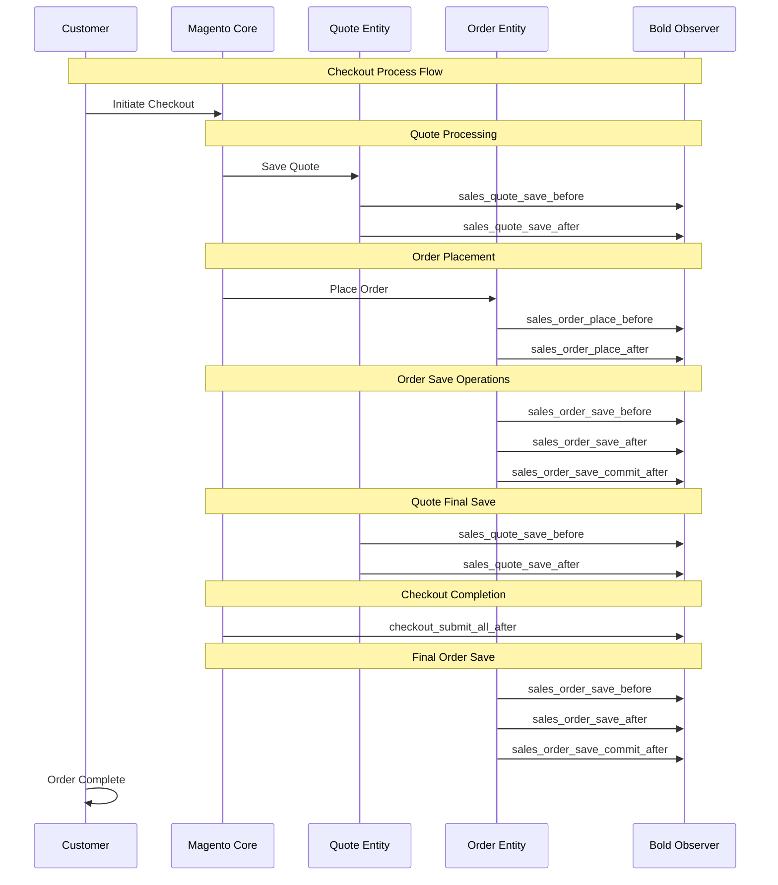

# Magento Event Order Flow

This diagram shows the sequence of Magento events that occur during the checkout process, based on the Bold Checkout Payment Booster event logging.

```mermaid
sequenceDiagram
    participant Customer
    participant Magento as Magento Core
    participant Quote as Quote Entity
    participant Order as Order Entity
    participant Observer as Bold Observer

    Note over Customer, Observer: Checkout Process Flow

    Customer->>Magento: Initiate Checkout
    
    Note over Magento, Observer: Quote Processing
    Magento->>Quote: Save Quote
    Quote->>Observer: sales_quote_save_before
    Quote->>Observer: sales_quote_save_after
    
    Note over Magento, Observer: Order Placement
    Magento->>Order: Place Order
    Order->>Observer: sales_order_place_before
    Order->>Observer: sales_order_place_after
    
    Note over Magento, Observer: Order Save Operations
    Order->>Observer: sales_order_save_before
    Order->>Observer: sales_order_save_after
    Order->>Observer: sales_order_save_commit_after
    
    Note over Magento, Observer: Quote Final Save
    Quote->>Observer: sales_quote_save_before
    Quote->>Observer: sales_quote_save_after
    
    Note over Magento, Observer: Checkout Completion
    Magento->>Observer: checkout_submit_all_after
    
    Note over Magento, Observer: Final Order Save
    Order->>Observer: sales_order_save_before
    Order->>Observer: sales_order_save_after
    Order->>Observer: sales_order_save_commit_after

    Customer->>Customer: Order Complete
```
